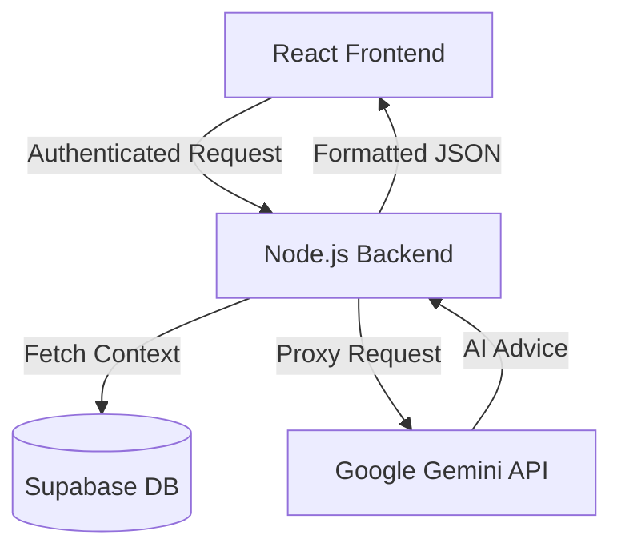

# ScholarSync AI Integration Guide

This document provides a technical overview of how the AI Student Performance Advisor is integrated into the ScholarSync platform.

## 1. Architecture Overview
The AI integration follows a secure, proxied architecture to protect API keys and ensure data privacy.

## 2. Backend Implementation (`server/src/routes/ai.ts`)

### Model Selection & Fallbacks
To ensure high availability, the server uses a multi-model fallback strategy. If the primary model (e.g., Gemini 2.5 Flash) is unavailable or throttled, it automatically tries stable alternatives.

**Attempt Order:**
1. `gemini-2.5-flash` (Cutting edge)
2. `gemini-2.0-flash`
3. `gemini-1.5-flash` (Stable fallback)
4. `gemini-1.5-pro` (Complex reasoning fallback)
5. `gemini-flash-latest`

### Context Awareness
Before calling the AI, the server fetches personalized student data using a Supabase RPC:
- **Courses & Grades**: Current performance metrics.
- **Study Logs**: Recent study habits and notes.
- **Assessments**: Upcoming deadlines and past results.

This data is injected into the AI's system prompt to provide actionable, context-aware academic advice rather than generic tips.

## 3. Frontend Integration (`client/src/pages/Chatbot.tsx`)

### Markdown Rendering
The UI uses `react-markdown` with several plugins to ensure the AI's output is beautiful and readable:
- **`remark-gfm`**: Supports tables, task lists, and strikethroughs.
- **`remark-breaks`**: Correctly renders single line breaks (essential for chat-style responses).
- **Custom Components**: Custom Tailwind styling for headers, bold text, and code blocks to match the ScholarSync premium theme.

### State Management
- **Automatic Scrolling**: Uses `useRef` and `useEffect` to keep the latest messages in view.
- **Optimistic UI**: User messages appear instantly before the API call finishes.
- **Manual Clear**: A "Clear Chat" feature that synchronizes both the local UI state and the Supabase database.

## 4. Security & Performance
- **Authentication**: All AI routes are protected by the `authenticateUser` middleware.
- **API Key Safety**: The `GEMINI_API_KEY` is stored exclusively as an environment variable on Render, never exposed to the client.
- **CORS**: Configured to allow requests only from your production Vercel domain.

## 5. Diagnostics
A hidden diagnostic route is available for administrators to check API connectivity and model availability:
`GET /api/ai/models`

## 6. Environment Variables Required
| Variable | Description | Location |
|----------|-------------|----------|
| `GEMINI_API_KEY` | Google AI Studio API Key | Render Dashboard |
| `VITE_API_URL` | URL of the Render Backend | Vercel Dashboard |
